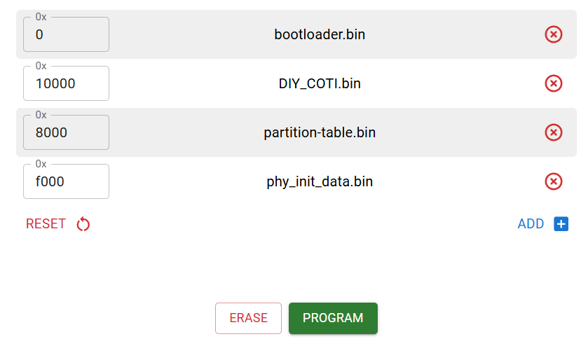

# Flashing compiled binaries

Flashing the esp32c3 super mini board via the web browser is only possilbe while having physcial accses to the "boot" button. Methode via esptool.py will also work via the usb-dataline pass through of the usb-c port on the housing. 

## esptool.py

Use the following command to flash `esptool.py` (included in esp-idf, and arduino-esp32 core installations)

`esptool.py -p COM1 -b 460800 --before default_reset --after hard_reset --chip esp32c3 write_flash --flash_mode dio --flash_freq 80m --flash_size detect 0x0 bootloader.bin 0x10000 DIY_COTI.bin 0x8000 partition-table.bin`

## web browser

1. Visit [esp.huhn.me](https://esp.huhn.me/) (recommend via chrome browser, others may not work)

2. Hold down the boot button, then insert the usb cable, then let go of the button.

3. Click connect, and select the serial-port of the esp32 board.

4. Add the following files at the given flash-offsets

(bootloader.bin at 0, DIY_COTI.bin at 10000, and partition-table.bin at 0x8000)

4. Click "ERASE", and wait for flash content to be erased

5. Then click "PROGRAM"
