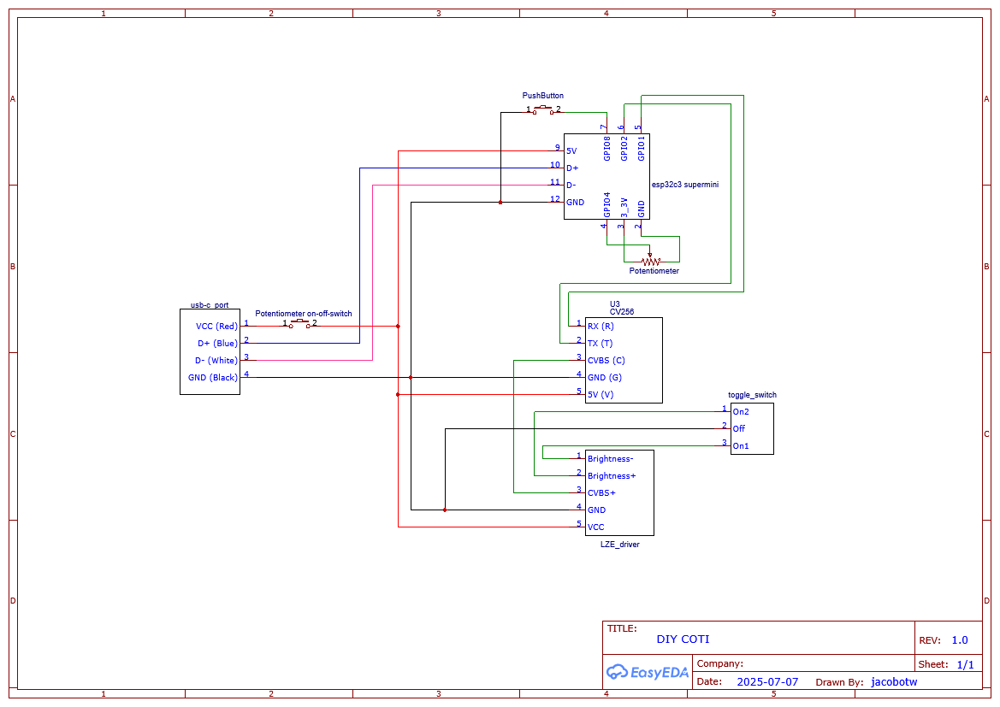

# BCOTI (Budget-Clip-On-Thermal-Imager)
This project is about building a Clip-On-Thermal-Imager (COTI) for Analog night vision goggles, similar to the Jerry-C, PAS29A/B, etc. yourself.

The current version uses a 256x192@12um sensor with a 9.1mm lens. This combined with the LZE039 and 25mm DCX lens, gives you a 1x 17°x13° thermal overlay in your NVGs. At the moment the image is cropped to a 13°x13° Rectangle.

Cropping it to a 13° circle is also an option by modifying the shape of the `Display_Spacer.step` model.

The unit is powered by a standard USB-C power source delivering 5v.

# User Manual

## Setting image settings

The BCOTI uses the Wi-Fi interface of the esp32 board to act as a web server to host a basic WebUI. To start the unit with Wi-Fi enabled, 

1. hold down the push-button and then supply the unit with power, so either plug in your cable (given the poti is already enabled) or enable the poti, keep the button held down for a short moment, then let go.

2. Open your phones Wi-Fi settings and connect to "BCOTI", the password is "wifipass1234"

3. Inside a web browser, open "192.168.4.1".

4. At the top you select the active preset, so the one being both used by the unit in real time, and the one you make changes to.

5. You can either enable or disable a preset, this determines if the preset will be used, or skipped when using the push button on the unit.

6. Once you made all your changes, reboot the unit to run it on the normal mode. Then use the push button to cycle through your active presets.

* If the local webpage won't load, try disabling your mobile-data, this is an issue with some OS that won't actually try and use the wifi network because it doesn't provide an internet connection. On IPhone this usually isn't an issue.

### Recommended Settings
- Burn protection. This will automatically close the shutter of the thermal camera if you look at something very hot, like a fire, or the sun. Note that when the unit is not powered, the shutter is in the open position, so it's highly recommended you cover the lens when the unit is not in use. Very hot object can burn the actual sensor.
- Auto Shutter. This will do Non-Uniformity-Correction (NUCing) based on conditions decided by the camera (temperature mostly).

- 

# Bill-of-materials
Expect to pay about 400€ (EU) or about 500usd (US) for parts when buying in small quantities

If you do end up buying these parts, and are happy with the end result, I'd appreciate it if you supported my future work on this and similar projects via my [BuyMeACoffee page](https://buymeacoffee.com/jacob_otw)

| Part                           | Cost   | Link                                                                                                   | Comment                                                                                                                                                                                                                                                                                                                                                                                                                                            |
|--------------------------------|--------|--------------------------------------------------------------------------------------------------------|----------------------------------------------------------------------------------------------------------------------------------------------------------------------------------------------------------------------------------------------------------------------------------------------------------------------------------------------------------------------------------------------------------------------------------------------------|
| Mini2                          | 189€   | [AliExpress (256 9.1mm option)](https://www.aliexpress.us/item/1005007938410808.html)                  | Only the 256 w/ 9.1mm version will work, others won't be 1x with current setup. [Hdaniee Store page incase the link doesn't work](https://www.aliexpress.com/store/1104212749?spm=a2g0o.detail.0.0.5c38Uf2FUf2Fd3), CV256 9.1mm. [For Some it might also be much cheaper to buy on Alibaba](https://www.alibaba.com/product-detail/HDANIEE-Series-Thermal-Imaging-Camera-Module_1601290252342.html?spm=a27aq.27095423.1978240560.1.78372277Z3cl82) |
| LZE039 OLED                    | 98€    | [AliExpress (AV 3color option)](https://www.aliexpress.us/item/1005008087046449.html)                  | Bare screen + AV driver.                                                                                                                                                                                                                                                                                                                                                                                                                           |
| Esp32c3 Super Mini             | 2.6€   | [AliExpress](https://www.aliexpress.us/item/1005007663345442.html)                                     | They can break during assembly, I'd recommend a 5pc for safety.                                                                                                                                                                                                                                                                                                                                                                                    |
| USB-C Connector Breakout (1x+) | 2.25€  | [AliExpress 2pc ("TYPE-C male 4P" option)](https://www.aliexpress.us/item/1005005870466748.html)       | At least 1x for device internal, but can also be used to created really low profile cable for helmet setup.                                                                                                                                                                                                                                                                                                                                        |
| USB-C Port                     | 1.49€  | [AliExpress ("4P Black" option)](https://www.aliexpress.us/item/1005005768848819.html)                 |                                                                                                                                                                                                                                                                                                                                                                                                                                                    |
| Toggle Switch                  | 1.19€  | [AliExpress ("3P 11.7ON-OFF-ON R" option)](https://www.aliexpress.us/item/1005008165436395.html)       |                                                                                                                                                                                                                                                                                                                                                                                                                                                    |
| Poti w/ ON-OFF-switch          | 2.59€  | [AliExpress 5pc ("20K Ohm" option)](https://aliexpress.us/item/1005003523748492.html)                  | Can also be higher resistance value, for voltage divider, without current draw like here, it doesn't really matter                                                                                                                                                                                                                                                                                                                                 |
| M2x4 Screws (11x)              | 1.35€  | [AliExpress 50pc (M2 x 50pc, 4mm length option)](https://www.aliexpress.us/item/1005008314123679.html) | I didn't use these exact ones, but should work, otherwise I adjust the hole size for the screw heads                                                                                                                                                                                                                                                                                                                                               |
| M2x3 Heat Inserts (11x)        | 9.99€  | [CNCKitchen 100pc](https://cnckitchen.store/products/heat-set-insert-m2-x-3-100-pieces)                | Could also get cheaper ones in similar size, but I like these because they give good info about the required hole sizes. Should you get one with a smaller OD, the FreeCad file has a parameter for that.                                                                                                                                                                                                                                          |
| 5mmD 25mmF DCX lens            | 41.61$ | [Edmund Optics](https://www.edmundoptics.com/p/5mm-dia-x-25mm-fl-uncoated-double-convex-lens/18171/)   | Price is really bad, but haven't found alternative yet.                                                                                                                                                                                                                                                                                                                                                                                            |
| 5x5x5mm right-angle-prism      | 1.99€  | [AliExpress](https://www.aliexpress.com/item/1005008430325318.html)                                    | This replaces the surface mirror used in previous versions, look into the change history for more info. [If the link doesn't work, try this one](https://www.aliexpress.com/item/4001089104491.html)                                                                                                                                                                                                                                               |
| 3mm Elastic band (1m)          | 1,99€  | [AliExpress ("3mm 10meters" option)](https://www.aliexpress.us/item/1005008987955538.html)             | should be between 2mm and 3mm thickness, you won't actually need a meter, but cutting them to the right sizes sometimes takes a few tries.                                                                                                                                                                                                                                                                                                         |
| 26AWG Silicone wire            | 10.29€ | [AliExpress ("26 AWG 60m" option)](https://www.aliexpress.us/item/1005005450546335.html)               | Any 26AWG (or close to) silicone wire will work, would recommend least 3 unique colors though.                                                                                                                                                                                                                                                                                                                                                     |
| O-Ring OD32 CS3.1              | 2.49€  | [AliExpress 50pc ("OD32mm CS3.1mm" option)](https://www.aliexpress.us/item/1005008292700053.html)      | Kinda optional, it by itself won't water proof the housing, as there are other way water can still get in besides the edge of the camera-cage, but it's a start.                                                                                                                                                                                                                                                                                   |
| 7mm Momentary Button           | 2.99€  | [AliExpress 5pc ("PBS-110 NO Black") option](https://www.aliexpress.us/item/1005008777027854.html)     |                                                                                                                                                                                                                                                                                                                                                                                                                                                    |
| 1.25mm 5pin jst cable          | 2.69€  | [AliExpress ("5set 5pin" option)](https://www.aliexpress.us/item/1005008669994352.html)                |                                                                                                                                                                                                                                                                                                                                                                                                                                                    |
| Heat shrink tubes              | 1.69€  | [AliExpress](https://www.aliexpress.us/item/1005008858472748.html)                                     |                                                                                                                                                                                                                                                                                                                                                                                                                                                    |
| Additional Part for lens clip  |        |                                                                                                        | Some of the mounting clip designs may require additional parts, like longer M2 screws, check the `CAD_Files/MountingClips/README.md` for more info.                                                                                                                                                                                                                                                                                                |

# Build-Guide

## Build Guide Video

A full video guide is also available, but I'd recommend have the written instructions open aswell, as any comments or changes will be made there.

### Important Notes
- The momentary push button is now connected to GPIO8 (was GPIO21)

## 3d printed parts

Using a dark material which absorbs light instead of reflecting it is highly recommend.

1. Print the `Body_Shell.step`, and `CameraCag.step` with a basic 0.12mm layer height profile.
Change the following
    1. Wall-loops to 3x or 4x. 
    2. Infill to about 22% to 35%
    3. Support to tree

     
    
     
    I'd recommend adding extra support to the push-button mount hole on the housing shell
     
    

2. Print the periscope like shown in the picture. <=0.12mm layer height, and I'd recommend "Snug" supports.
 

 
After the print, press fit the prism and DCX lens into the periscope. After checking functionally, you can glue on the side cover

3. (Optional, but recommended) print the `Bikini_Cover_TPU.step` out of a fairly soft TPU. I printed mine out of 95A Overture TPU

## Electronics

### Step-by-step

Using Heat shrink for all connections where possible is recommended.

1. Cut the cables of the USB-C port to a length of around 80mm.
2. Cut a 1x 80mm piece of (Red) wire. And 3x 40mm pieces of (Red) Wire. These will be your 5V-net. Strip a portion of the installation on one side so that you can twist together the 3x short pieces, then cover in solder.
3. Cut 5x 40mm pieces of black wire. These will be your ground-net. Strip one side and combine the 5pieces, same as you did for the 5v-net.
4. Solder the 80mm piece of (Red) wire, to the potentiometer's on-off-switch.
 

(picture shows USB-C Port wire already connector, this is done during assembly)

5. Solder the bundle of 3 (Red) wires to the 80mm piece from the previous step.
 

6. Attach the 5v wires, as well as ground to the USB-C breakout board, the display driver connector, and the camera connector, as shown in the diagram.

7. Connect ground wires to the push-button, and on-off-on toggle switch.

8. Cut a 50mm piece of wire, solder one end to the push button, and the other to under side, facing inwards to the esp32c3's GPIO21 pin.
 

9. Cut the `brightness+` and `brightness-` cables of the display driver to a length of about 70mm, then attach them to the `on`-terminals of the toggle-switch.
 

10. Connect the white wire of the usb-c port to the D- Pad of the USB-C breakout board, and the blue wire to D+.
 

11. Connect the RX wire of the camera to GPIO1, and the TX wire to GPIO2 of the esp32c3 board. The cables should be attached on the underside facing inwards.
 

12. Using 3x 50mm pieces of wire, connect the potentiometer to the esp32 board like shown in the schematic. Ground should be on the left, sense-wire (GPIO4) in the centre, and 3.3v on the right, that way the power goes from 0v to 3.3v when it's turned up, instead of being reversed.
 

13. Connect the Video-out of the camera to the `CVBS+` cable of the display driver. Total wire length is recommended at 130mm. 

## Assembly

1. Insert the USB-C Port into the housing.

2. Solder the 5v wire of the Port to the on-off-switch of the potentiometer

3. Insert the potentiometer into the shell (from the inside) with the pins pointing down, and fix in place the with the Nut and washer.
 

4. Insert the Brightness Toggle switch (horizontal orientation), and fix in place with washer and nut.
 

5. With the USB-Port facing down, and the usb-c breakout connector inserted, insert the esp32 board into the centre slot of the shell
 

6. Disconnect the display from the driver, and insert the FPC through the hole of the slot for the display.

7. Connect the display to the driver again, then insert the driver (with the wires pointing into the shell) into the slot.

8. Insert the push-button into the slot on the bottom of the shell, and fix it in place with the nut and washer.

9. Wrap the O-Ring around the CameraCage, and insert the camera module (with the JST connector facing down, away from the slot in the top of the cage), then fix in place with all 6x M2x4 sews. Tighten them evenly, instead of doing one fully after the other.

10. Check if the camera cage can be fully inserted without putting pressure on the display FPC or any components inside the shell.

11. Insert the 11x heat inserts into the holes with your soldering iron.

12. Attach the Lens clip, Periscope, and Camera cage with the 11x M2x4 screws.

13. Attach the unit to your NV device and check the alignment of the image. (Should the image be mirrored incorrectly, adjust it via the WebUI's "Flip Mode" setting)
    1. Attach the unit like shown in the picture, so hanging straight down from your NV unit
     
    

    2. If the thermal image is too far left or right, check that the camera cage is properly installed. This usually isn't an issue.

    3. If the thermal image is too far up or down, you can reprint the CameraCage with a different offset. If the overlay it too high, the camera needs to look up more. I plan to have a way of mechanically adjusting the camera position via screws, but this is not ready yet.

